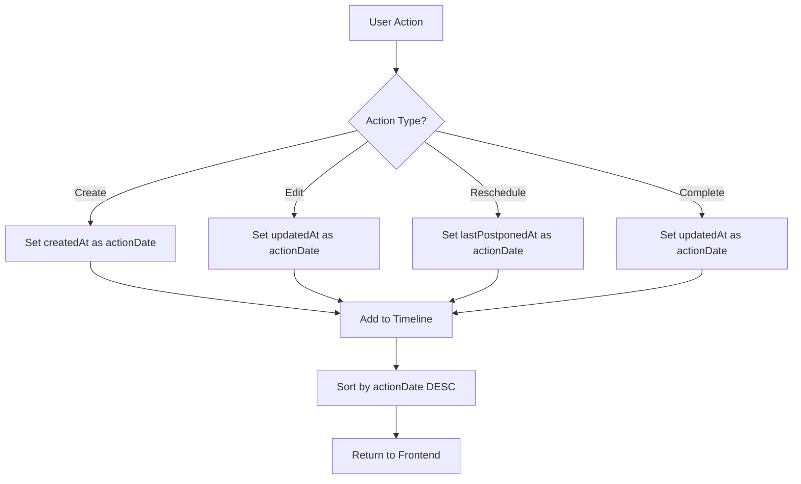
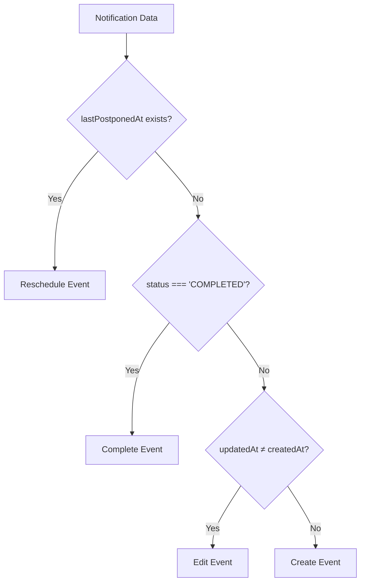

# Timeline Implementation Guide
## SCG Notification System - User Activity Log

### วัตถุประสงค์

ระบบ Timeline (User Activity Log) ถูกออกแบบมาเพื่อแสดงประวัติกิจกรรมทั้งหมดของผู้ใช้ในระบบ notification โดยสามารถแยกแยะประเภทของการกระทำต่าง ๆ ได้อย่างถูกต้อง และเรียงลำดับตามเวลาที่เกิด action จริง

---

## โครงสร้างระบบ

### Backend Architecture

#### 1. Timeline Controller (`/backend/src/controllers/timeline.controller.ts`)

**หน้าที่หลัก:**
- จัดการ API endpoint `/api/timeline`
- รวมข้อมูลจาก Notification และ Approval
- แปลงข้อมูลเป็น Timeline Events
- จัดเรียงลำดับตาม actionDate

**Key Features:**
- **Cursor-based Pagination:** รองรับการแบ่งหน้าด้วย cursor
- **Event Type Detection:** แยกแยะประเภท event อัตโนมัติ
- **Action Date Mapping:** กำหนดวันที่ action จริงสำหรับแต่ละ event
- **Metadata Enrichment:** เพิ่มข้อมูลเสริมสำหรับ frontend

#### 2. Event Type Classification

```typescript
// การตรวจสอบประเภท Event
const wasEdited = notification.updatedAt && 
                 new Date(notification.updatedAt).getTime() !== new Date(notification.createdAt).getTime();
const wasRescheduled = !!notification.lastPostponedAt;
```

**ประเภท Events:**
1. **สร้างงาน (Create):** Event พื้นฐานจาก `createdAt`
2. **แก้ไขงาน (Edit):** ตรวจจาก `updatedAt ≠ createdAt`
3. **เลื่อนงาน (Reschedule):** ตรวจจาก `lastPostponedAt` มีค่า
4. **เสร็จงาน (Complete):** ตรวจจาก `status === 'COMPLETED'`

#### 3. Action Date Logic

```typescript
// กำหนด actionDate ตามประเภท event
let actionDate = notification.createdAt;
if (wasRescheduled && notification.lastPostponedAt) {
  actionDate = notification.lastPostponedAt;  // ใช้วันที่เลื่อนล่าสุด
} else if (wasEdited && notification.updatedAt) {
  actionDate = notification.updatedAt;        // ใช้วันที่แก้ไขล่าสุด
}
if (notification.status === 'COMPLETED' && notification.updatedAt) {
  actionDate = notification.updatedAt;        // ใช้วันที่เสร็จงาน
}
```

**หลักการ:**
- **สร้างงาน:** `createdAt`
- **เลื่อนงาน:** `lastPostponedAt` (มีความสำคัญสูงสุด)
- **แก้ไขงาน:** `updatedAt` 
- **เสร็จงาน:** `updatedAt` (override การแก้ไข)

#### 4. Metadata Structure

```typescript
interface NotificationMetadata {
  notificationId: string;
  type: string;
  hasEdit: boolean;           // มีการแก้ไขหรือไม่
  hasReschedule: boolean;     // มีการเลื่อนหรือไม่
  actionDate: Date;           // วันที่ action จริง
  
  // Edit information
  editedAt?: Date;
  originalCreatedAt?: Date;
  
  // Reschedule information
  lastPostponedAt?: Date;
  originalDueDate?: Date;
  postponeReason?: string;
  postponeCount?: number;
  
  // Current schedule
  scheduledAt?: Date;
}
```

#### 5. Sorting Algorithm

```typescript
const allEvents = [...notificationEvents, ...approvalEvents]
  .sort((a, b) => {
    // ใช้ actionDate จาก metadata ถ้ามี, ถ้าไม่มีใช้ createdAt
    const aAction = a.metadata?.actionDate ? 
                   new Date(a.metadata.actionDate).getTime() : 
                   a.createdAt.getTime();
    const bAction = b.metadata?.actionDate ? 
                   new Date(b.metadata.actionDate).getTime() : 
                   b.createdAt.getTime();
    
    const dateCompare = bAction - aAction; // เรียงจากใหม่ไปเก่า
    return dateCompare !== 0 ? dateCompare : b.id.localeCompare(a.id);
  });
```

---

### Frontend Integration

#### 1. API Response Format

```typescript
interface TimelineResponse {
  events: TimelineEvent[];
  nextCursor: string | null;
  hasMore: boolean;
}

interface TimelineEvent {
  id: string;
  type: 'notification' | 'approval';
  title: string;
  status: string;
  createdAt: Date;
  updatedAt?: Date;
  message?: string;
  metadata?: NotificationMetadata;
}
```

#### 2. Frontend Event Mapping

```typescript
// ใน /frontend/src/pages/user-logs/page.tsx
const getActionText = (log: TimelineEvent) => {
  if (log.metadata?.hasReschedule) {
    return "เลื่อนกำหนดงาน";  // Reschedule
  } else if (log.metadata?.hasEdit) {
    return "แก้ไขงาน";         // Edit
  } else if (log.status === 'COMPLETED') {
    return "เสร็จสิ้นการแจ้งเตือน"; // Complete
  } else {
    return "สร้างงาน";          // Create
  }
};
```

#### 3. Date Display

```typescript
// ใช้ actionDate จาก metadata หรือ createdAt
const displayDate = log.metadata?.actionDate || log.createdAt;
```

---

## Database Schema

### Notification Table Fields

```sql
-- Required fields for timeline functionality
id                VARCHAR PRIMARY KEY
title             VARCHAR NOT NULL
status            ENUM('PENDING', 'SENT', 'COMPLETED', 'FAILED')
createdAt         TIMESTAMP DEFAULT NOW()
updatedAt         TIMESTAMP DEFAULT NOW() ON UPDATE NOW()

-- Reschedule tracking fields
lastPostponedAt   TIMESTAMP NULL
originalDueDate   TIMESTAMP NULL
postponeReason    TEXT NULL
postponeCount     INTEGER DEFAULT 0

-- Schedule fields
scheduledAt       TIMESTAMP NULL
type             VARCHAR NOT NULL
message          TEXT
createdBy        VARCHAR NOT NULL
```

---

## การทำงานของระบบ

### 1. Timeline Event Creation Flow



### 2. Event Type Detection Logic



### 3. Action Date Priority

```
1. Reschedule (lastPostponedAt) - สูงสุด
2. Complete (updatedAt when status = COMPLETED)
3. Edit (updatedAt when different from createdAt)
4. Create (createdAt) - ต่ำสุด
```

---

## Best Practices

### 1. Backend Development

- **Always include reschedule fields** ในการ select ข้อมูล notification
- **Use actionDate for sorting** แทนการใช้ createdAt เพียงอย่างเดียว
- **Validate metadata completeness** ก่อนส่งให้ frontend
- **Handle timezone consistency** ระหว่าง database และ application

### 2. Frontend Development

- **Check metadata existence** ก่อนใช้ hasEdit หรือ hasReschedule
- **Use actionDate for display** เพื่อความถูกต้องของเวลา
- **Implement proper loading states** สำหรับ timeline pagination
- **Handle empty states gracefully**

### 3. Database Operations

- **Index on actionDate fields** เพื่อ performance
- **Ensure atomic updates** เมื่ออัปเดต notification status
- **Regular data validation** สำหรับ reschedule fields

---

## Troubleshooting

### ปัญหาที่พบบ่อย

#### 1. Event แสดงผลผิดประเภท

**สาเหตุ:** metadata ไม่ถูกส่งหรือ logic การตรวจสอบผิด
**แก้ไข:** ตรวจสอบการ select fields และ mapping logic

#### 2. เรียงลำดับผิด

**สาเหตุ:** ใช้ createdAt แทน actionDate ในการ sort
**แก้ไข:** ใช้ actionDate จาก metadata ในการเรียงลำดับ

#### 3. Reschedule ไม่แสดงใน timeline

**สาเหตุ:** lastPostponedAt ไม่ได้ถูก update หรือ select
**แก้ไข:** ตรวจสอบ reschedule API และ database migration

---

## Testing

### Unit Tests

```typescript
describe('Timeline Controller', () => {
  it('should classify reschedule events correctly', () => {
    // Test reschedule detection logic
  });
  
  it('should sort events by actionDate', () => {
    // Test sorting algorithm
  });
  
  it('should include all required metadata', () => {
    // Test metadata completeness
  });
});
```

### Integration Tests

```typescript
describe('Timeline API', () => {
  it('should return events in correct order', async () => {
    // Test full API response
  });
  
  it('should handle pagination correctly', async () => {
    // Test cursor-based pagination
  });
});
```

---

## การปรับปรุงในอนาคต

### Phase 1: Current Implementation ✅
- [x] Basic event classification
- [x] Action date mapping
- [x] Metadata enrichment
- [x] Correct sorting

### Phase 2: Enhancement Ideas
- [ ] Real-time timeline updates
- [ ] Advanced filtering options
- [ ] Bulk operations timeline
- [ ] Performance optimization
- [ ] Cache implementation

### Phase 3: Advanced Features
- [ ] Timeline analytics
- [ ] Export functionality
- [ ] Cross-user timeline view
- [ ] Timeline search

---

## สรุป

ระบบ Timeline นี้ให้ความสำคัญกับความถูกต้องของการแสดงประเภท event และลำดับเวลา โดยใช้ actionDate เป็นตัวกำหนดหลักในการเรียงลำดับ และ metadata ที่สมบูรณ์เพื่อให้ frontend สามารถแสดงผลได้อย่างถูกต้อง

การออกแบบนี้ทำให้ระบบสามารถรองรับการเปลี่ยนแปลงในอนาคตได้ดี และง่ายต่อการ maintain และ debug เมื่อเกิดปัญหา
